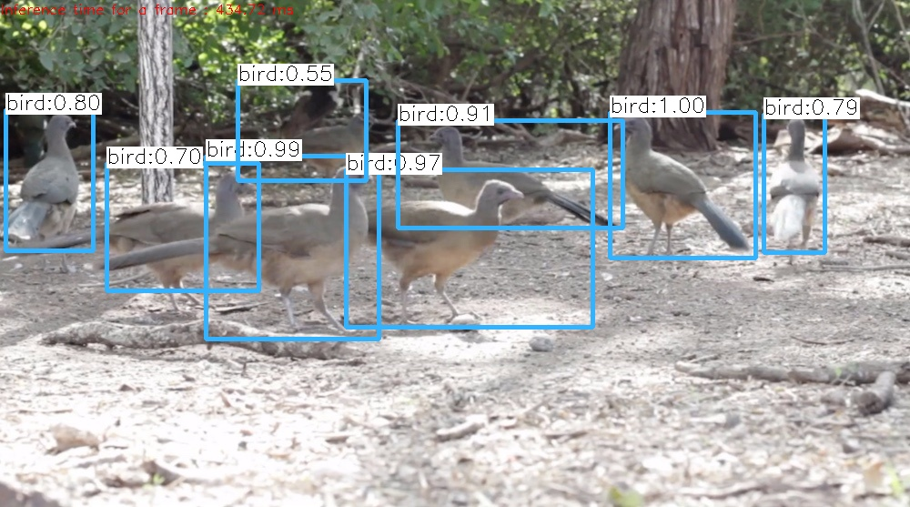
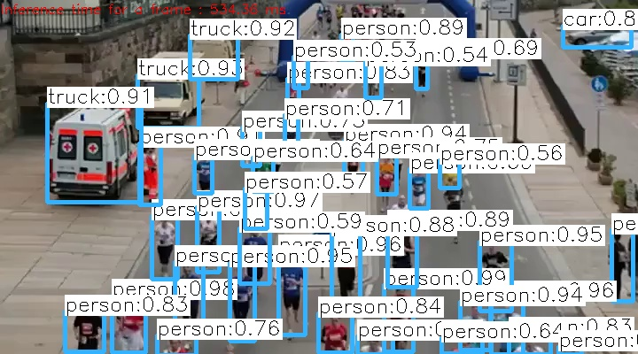

# Object Detection using YOLOv3

## Download the models

```bash
bash scripts/get_models_yolo.sh
```

## Run object detection

```bash
./_output/bin/detection/object_detection_yolo --image=data/detection/bird.jpg
```



```bash
./_output/bin/detection/object_detection_yolo --video=data/detection/run.mp4
```



## References

* [Deep Learning based Object Detection using YOLOv3 with OpenCV ( Python / C++ )](https://www.learnopencv.com/deep-learning-based-object-detection-using-yolov3-with-opencv-python-c/)
* [Training YOLOv3 : Deep Learning based Custom Object Detector](https://www.learnopencv.com/training-yolov3-deep-learning-based-custom-object-detector/)
